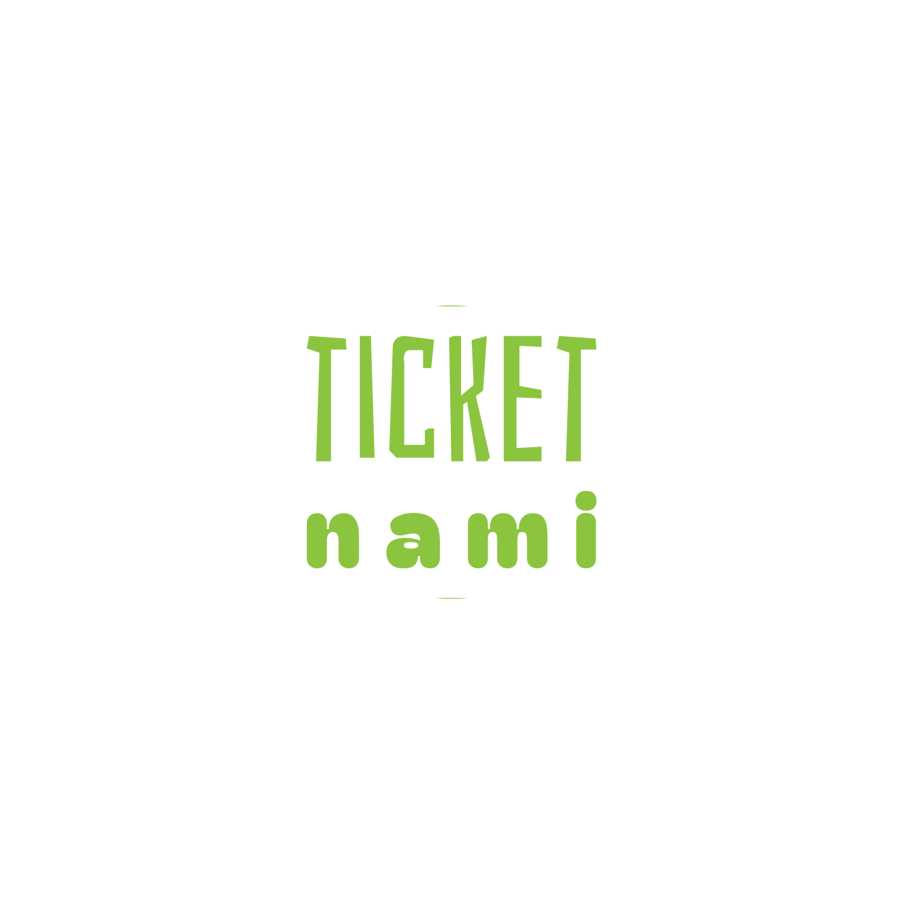

<!-- PROJECT LOGO -->
<br />
<div align="center">
  <a href="https://github.com/othneildrew/Best-README-Template">

  </a>

  <h3 align="center">Ticket Nami Project</h3>

  <p align="center">
    This Project to book tickets for events
    <br />
    <a href="https://ticket.longphanp.com"><strong>Website</strong></a>
  </p>
</div>

<!-- TABLE OF CONTENTS -->
<details>
  <summary>Table of Contents</summary>
  <ol>
    <li>
      <a href="#about-the-project">About The Project</a>
      <ul>
        <li><a href="#built-with">Built With</a></li>
      </ul>
    </li>
    <li>
      <a href="#getting-started">Getting Started</a>
      <ul>
        <li><a href="#prerequisites">Prerequisites</a></li>
        <li><a href="#installation">Installation</a></li>
      </ul>
    </li>
    <li><a href="#usage">Usage</a></li>
    <li><a href="#roadmap">Roadmap</a></li>
    <li><a href="#contributing">Contributing</a></li>
    <li><a href="#license">License</a></li>
    <li><a href="#contact">Contact</a></li>
    <li><a href="#acknowledgments">Acknowledgments</a></li>
  </ol>
</details>

<!-- ABOUT THE PROJECT -->

## About The Project

[![Product Name Screen Shot][product-screenshot]](src/assets/screenshot.png)

- This website allow you to book a ticket for an event
- This also include admin page to manage ticket booking and events.

> User page: https://ticket.longphanp.com

> Admin page: https://ticket.longphanp.com/admin

<p align="right">(<a href="#readme-top">back to top</a>)</p>

### Built With

- [![Node][Node]][Node-url]
- [![Typescript][Typescript]][Typescript-url]
- [![React][React.js]][React-url]
- [![Vite][Vite]][Vite-url]
- [![Mui][Mui]][Mui-url]

<p align="right">(<a href="#readme-top">back to top</a>)</p>

<!-- GETTING STARTED -->

## Getting Started

### Prerequisites

You need to install Node >= v18.19.1

- MacOS

```bash
  brew install node@18.19.1
```

- Linux

```bash
  sudo apt install node@18.19.1
```

Check to see node available on your machine

```bash
  node -v
```

### Installation

1. Clone the repo
   ```sh
   git clone https://github.com/longphanp/booking-ticket-web.git
   ```
2. Install NPM packages
   ```sh
   npm install
   ```
3. Create .env file that include
   ```
    VITE_GOOGLE_CLIENT_ID=
    VITE_TICKET_API_ENDPOINT=
   ```

<p align="right">(<a href="#readme-top">back to top</a>)</p>

<!-- USAGE EXAMPLES -->

### Run this project

- For development env

  ```bash
    npm run dev
  ```

  Go to http://localhost:5173

- For production env

  ```bash
    npm run build
    npx serve -v dist
  ```

  Go to http://localhost:3000

## Contact

Phan Long - phanlonghd5200@gmail.com

Project Link: [https://github.com/longphanp/booking-ticket-web.git](https://github.com/longphanp/booking-ticket-web.git)

<p align="right">(<a href="#readme-top">back to top</a>)</p>

<!-- MARKDOWN LINKS & IMAGES -->
<!-- https://www.markdownguide.org/basic-syntax/#reference-style-links -->

[product-screenshot]: images/screenshot.png
[React.js]: https://img.shields.io/badge/React-20232A?style=for-the-badge&logo=react&logoColor=61DAFB
[React-url]: https://reactjs.org/
[Vite]: https://img.shields.io/badge/vite-%23646CFF.svg?style=for-the-badge&logo=vite&logoColor=white
[Vite-url]: https://vitejs.dev/
[Mui]: https://img.shields.io/badge/MUI-%230081CB.svg?style=for-the-badge&logo=mui&logoColor=white
[Mui-url]: https://mui.com/
[Node]: https://img.shields.io/badge/node.js-6DA55F?style=for-the-badge&logo=node.js&logoColor=white
[Node-url]: https://nodejs.org/en
[Typescript]: https://img.shields.io/badge/typescript-%23007ACC.svg?style=for-the-badge&logo=typescript&logoColor=white
[Typescript-url]: https://www.typescriptlang.org/
